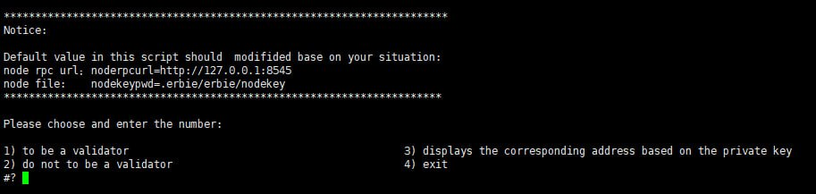
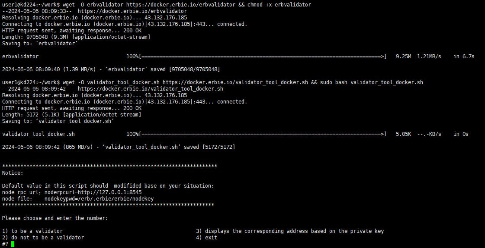

Become a Validator
=====================

Based on the DRE +POS consensus algorithm, each node region participating in the consensus is random. However, the more significant the stake, the more likely it is to get more reward.

.. Note::

	The minimum threshold to become a validator is 350 ``ERB``. If you want to participat in generating block and consensus to get reward, you need other stakers to pledge more than 34,650 ERBs to your account address(total amount is 35000 or more).

Then you can become a miner by sending transactions. Refer to `Validator and Staker <https://www.erbie.io/erbiedocs/newnavigation/interfaces/OpenAPI/stake.html>`__.
You also can use **validator_tool.sh** to become a validator. You can find validator_tool.sh in `erbie source code <https://github.com/erbieio/erbie>`__.

How to use validator_tool.sh
----------------------------------

1. When you run the erbie node, it will generate a **.erbie** directory. Make sure **validator_tool.sh** is in the same directory as **.erbie**. run it:

.. code:: shell

   ./validator_tool.sh

.. Note::

	validator_tool.sh need program erbvalidator. If don't have erbvalidator,
	If you do not have the erbvalidator program, you can find cmd/erbvalidator in the erbie source code.
	Navigate to this directory and use the go build command to compile and obtain.

2. Type 1 and press Enter

3. Input private key of the address that you want to be a validator. If you see something like the below image, you have succeeded.

.. image::
    ../../_static/validatortool/tool-2.jpg

4. Type 4 to exit terminal

.. image::
    ../../_static/validatortool/tool-5.jpg

Do not to be validator
==========================

If you don't want to be a validator again, you can also use validator_tool.sh.

Type 2, like the below image:

.. image::
    ../../_static/validatortool/tool-3.jpg

Docker-running erbie node
===============================

If your eribe node is Docker-running node, and also want to become a validator, you can do as below:

1. download erbvalidator

.. code:: shell

   wget -O erbvalidator https://docker.erbie.io/erbvalidator && chmod +x erbvalidator

2. download validator_tool_docker.sh and running

.. code:: shell

   wget -O validator_tool_docker.sh https://docker.erbie.io/validator_tool_docker.sh && sudo bash validator_tool_docker.sh

The usage of validator_tool_docker.sh is similar to that of validator_tool.sh .

as shown below:

