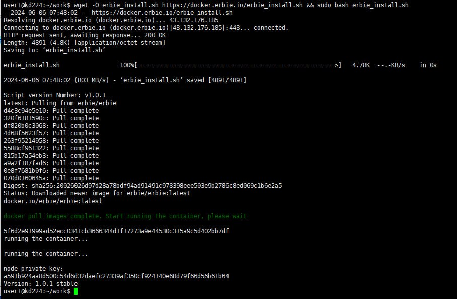

Docker Clients Setup
============================================================

Preparation
---------------------
- Operating System: Linux

- Install wget.

  Please go to the `wget website <https://www.gnu.org/software/wget/>`__ to download and install it. 
  If you are using Linux system, you can also install it using the ``apt-get install wget`` command. 

- Install Docker.

  For the installation and use of Docker, please refer to the `Docker Official Documentation <https://docs.docker.com/engine/install/>`__.

Process for deploying nodes for the first time
-----------------------------------------------

1. Execute the following command to start launching the node. 

   .. code::
      
      wget -O erbie_install.sh https://docker.erbie.io/erbie_install.sh && sudo bash erbie_install.sh

as shown below:

2. Conduct the command as follows, check whether the Erbie container is normally running or not and if it Shows UP, which means yes.

   ``sudo docker ps -a``

   .. image::
      ../../_static/png/latest4.png